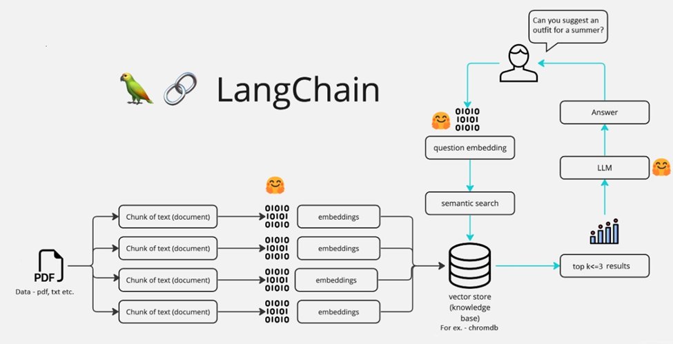

# 🤖FashionBot: Your AI Style Companion 👗👠
----------------------------------------------------------
### Youtube Tutorial Link: https://youtu.be/de6_BjEVWZo
### Report & Other Document: Available in github Repo [FashionBot_Report.pdf & FashionBot_ppt.pdf]
----------------------------------------------------------
## What is FashionBot?
FashionBot 🤖 is a sophisticated chatbot designed to provide personalized fashion advice. Leveraging a user's natural language queries, it offers recommendations on outfits, accessories, and styling tips directly from a curated fashion knowledge base.
## How It Is Built?

**FashionBot** utilizes several advanced technologies:

- **Streamlit**: Delivers an interactive user interface for real-time user interaction.
- **LangChain**: Integrates the language model (LLM) with the vector database.
- **RecursiveTextSplitter**: Splits the PDF containing fashion data into manageable chunks.
- **Hugging Face's sentence-transformers/all-MiniLM-L6-v2 Model**: Creates text embeddings.
- **Chroma Vector Database**: Efficiently stores and retrieves text embeddings for semantic search.
- **Meta-Llama-3-8B-Instruct with HuggingFace API**: Provides the processing power for natural language understanding.
- **Directive-based prompt pattern**: Guides the language model on how to generate appropriate responses based on the query context and user interaction directives.

## Architecture Overview


## Instructions on How to Setup and Run

### Step 1: Install Required Python Libraries

Install the necessary libraries from the requirements.txt file:

```bash
pip install -r requirements.txt
```
**NOTE:**
If there is issue with Chroma and Pysqlite3 installation, follow below steps 
- Download Python 3.10 version and then install chromadb using below command
```bash
pip install chromadb
``` 
- For pysqlite3 installation keep the wheel file (available in Github repo) in your project directory and run below command
```bash
pip install pysqlite3_wheels-0.5.0-cp310-cp310-win_amd64
```

### Step 2: Generate and Store Embeddings
There are two Python files: `embeddings_generator.py` and `WaLL-E.py`.

1. **Set Up API Keys**: Ensure your HuggingFace API Token is in the .env file
```bash
HUGGINGFACEHUB_API_TOKEN = "<HUGGINGFACEHUB_API_TOKEN>"
```
2. **Generate Embeddings**: Run `vector_embeddings.py` to process the fashion data PDF and store the results in the Chroma Vector Database in the **"data"** directory.
```bash 
python vector_embeddings.py
```

### Step 3: Launch FashionBot
After setting up the embeddings, launch the FashionBot interface by running:
```bash
streamlit run FashionBot.py
```

### Step 4: Testing and Evaluation
FashionBot 🤖 can handle diverse queries such as:

- Detailed outfit suggestions for specific occasions like weddings or business meetings.
- Advice on incorporating vintage accessories into modern outfits.
- Recommendations for updating a wardrobe for the upcoming season.
- Styling tips for making a good impression on a first date.

Examples include:

- **Simple Query**: "_What are the latest summer fashion trends?_"
- **Complex Query**: "_What are some ways to style a white t-shirt for different occasions?_"
- **Scenario-Based Query**: "_I have a travel plan this weekend that includes visiting historical sites, shopping, and attending a concert. Could you please suggest outfits and accessories to match styles for all these occasions?_"
- **Irrelevant/Out-of-Scope Queries**: "_Why is the sky blue?_"
- **Misspelled Queries**: "_men cliothin recommenations?_"

